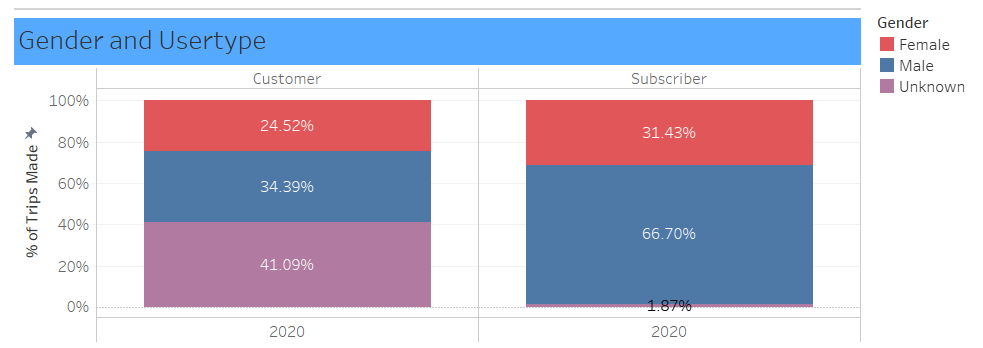
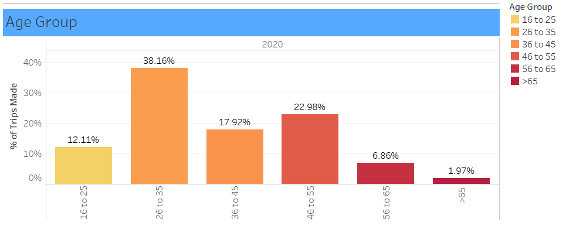
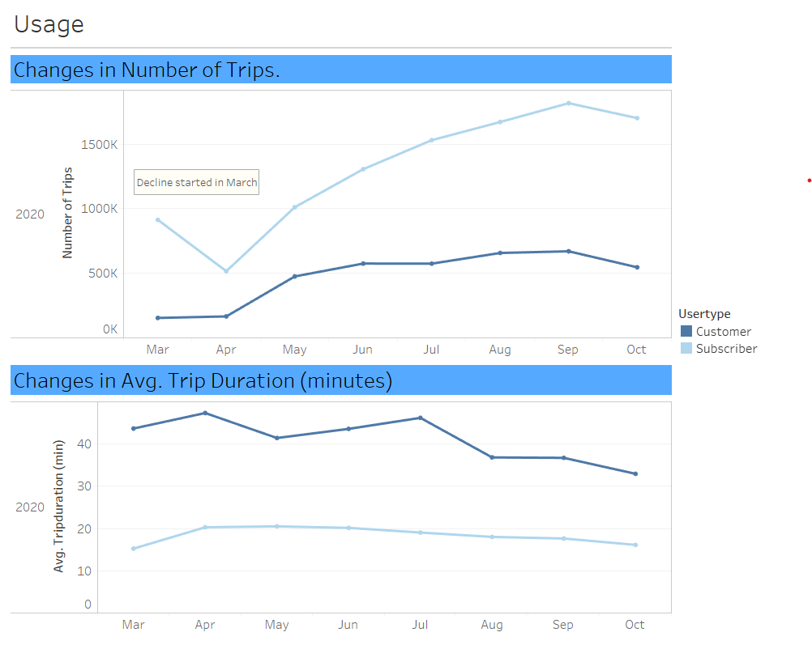
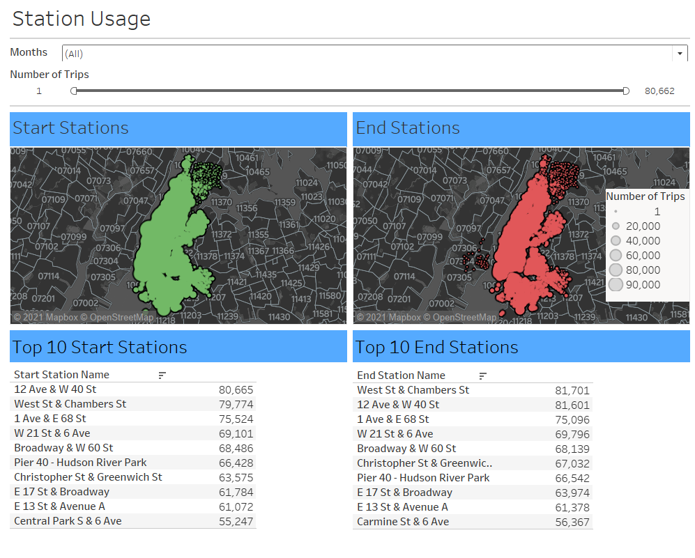
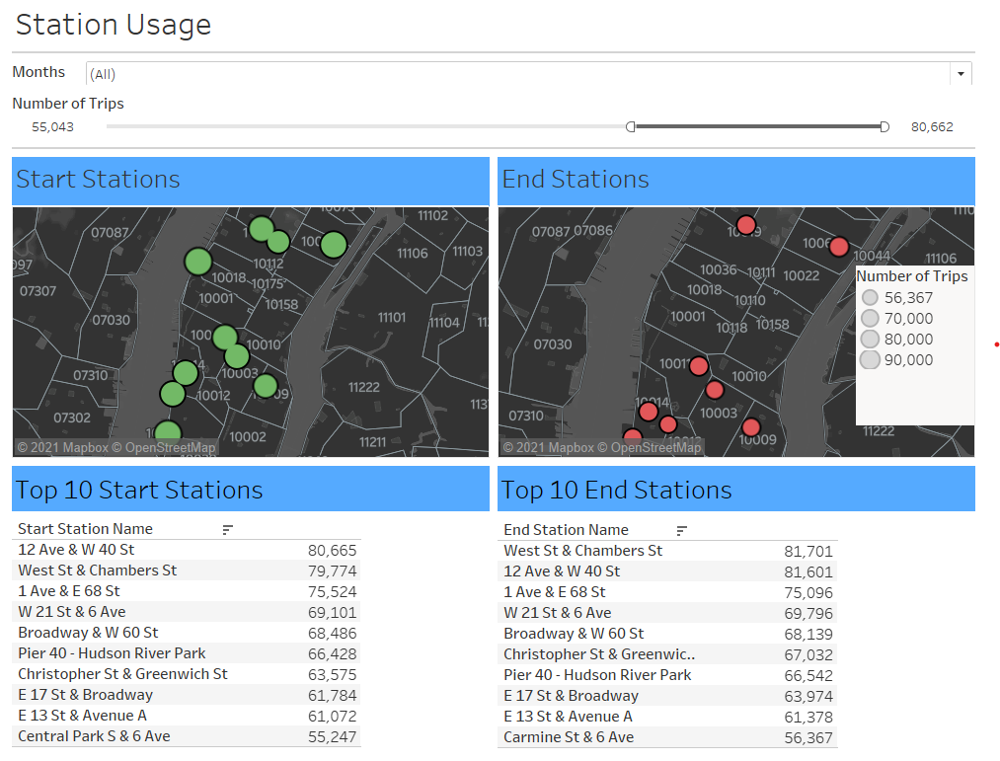

# Tableau Challenge!
#### Using Tableau and Data from Citi Bike in NYC to find interesting phenomena and display them in visualizations.
###### Rodrigo Lozano - 2020
-----

# Background:
The Citi Bike platform collects all kinds of data for analysis: where people go, most popular stations, how long trips last and more about its Customers and Subscribers.
I decided that analyzing datasets from every month in 2018, 2019 and all available months in 2020 would give an interesting insight on how the platform has progressed as of late. 

Moreover, I'd see how the COVID-19 pandemic has affected the service.

# Approach:
* Merge monthly data from 2018, 2019 and 2020 using [Jupyter Notebook](https://github.com/RoLDT/tableau-challenge/blob/main/Data_Cleaning/Data%20Cleaning%20-%20Creation%20of%20Master%20File.ipynb). All data can be found [here.](https://s3.amazonaws.com/tripdata/index.html)
* Analyze the merged data in Tableau and look into possible findings.
* Deploy it in Tableau Public.

# Hurdles:
During the analysis in Tableau, I realized that Tableau Public could not take more than 15,000,000 rows of data and I was working with much more than that.

~Lucky me~

I decided to work only with data from 2020 because it interests me how Citi Bike is doing with COVID-19 going on.

# Findings:
During 2020, Subscribers to the platform were predominantly Male. It can also be seen that Customers don't trust the plastform enough to share their Gender.

By the end of 2020, we can see that approximately 60% of the users of Citi Bike are 26 to 35 and 46 to 55 years old.

Regarding the number of trips, they took a hit during the beginning of the pandemic. However, users started using the service more until a decline in October, likely due to the colder temperatures.

Interestingly, the trips made in 2020 by Subscribers, with the pandemic going on, were lasting much more than the trips made by Customers. I pin this on the fact that most people in Manhattan do not own personal vehicles for transportation and were not willing to risk getting in a cab with someone they do not know.

The Top 10 Starting and Ending Stations are basically the same throughout the year.

It's worth noting how the stations that see the most usage are in Lower Manhattan. These stations probably need regular maintenance to assure users that they won't break down.

-----

# Tableau Public:
You can find the depolyed visualizations [here](https://public.tableau.com/profile/rodrigo.lozano#!/vizhome/TableauChallenge_CitiBikeAnalysis_Extract/Story1)!
